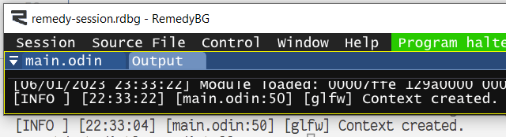

# Debugger logger for Odin

Dual logging to STDOUT and the debugger console using OutputDebugStringW.  
Also provides a function to attach to the standard output of the parent window.  

Example:
```odin
package main

import "core:log"

main :: proc() {
    win32_open_console_or_attach_to_parent()

    context.logger = create_debugger_logger()
    log.info("[glfw] Context created.")
}
```


